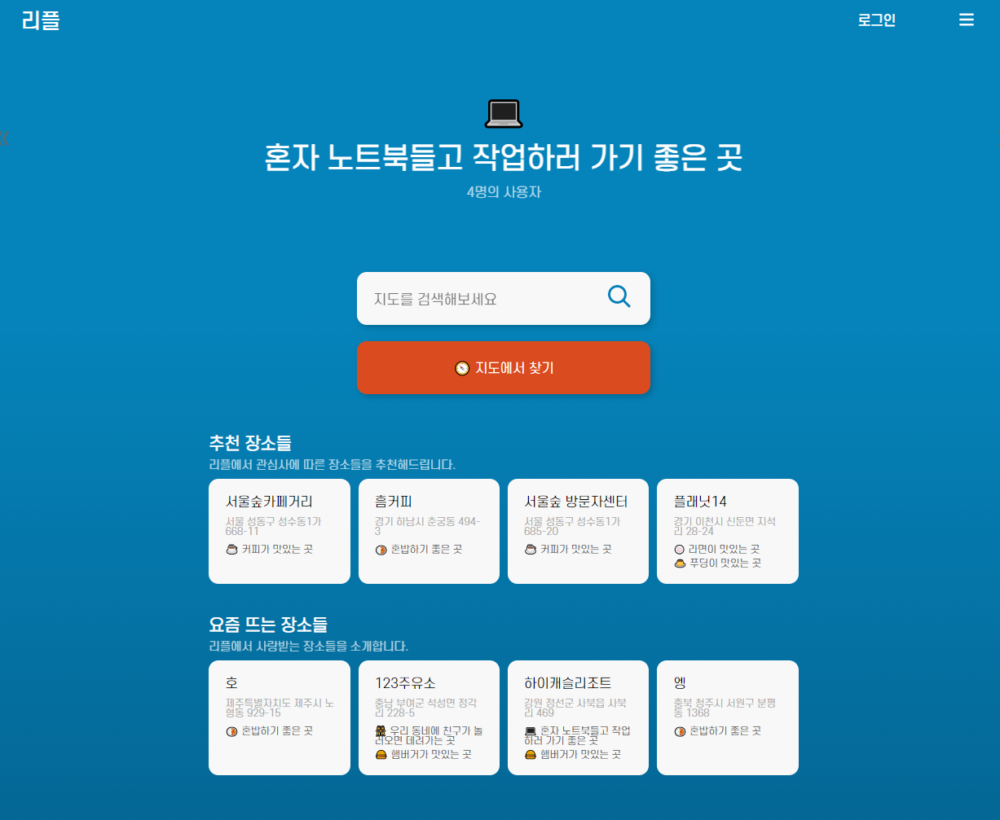
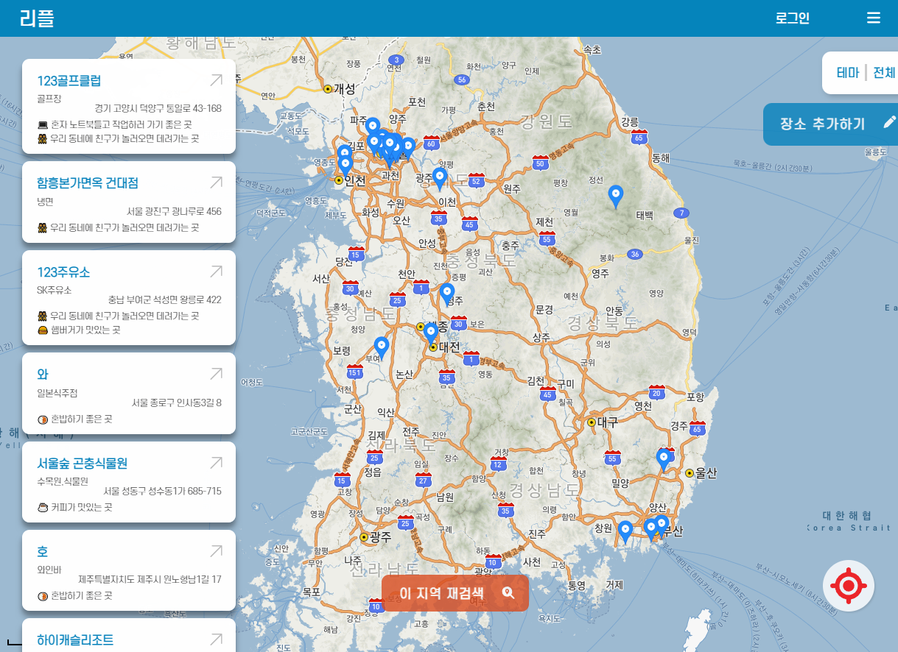
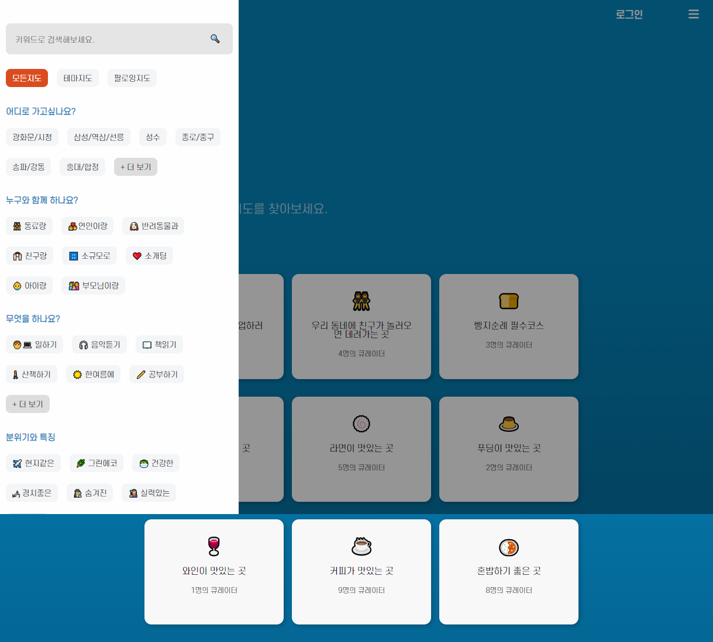
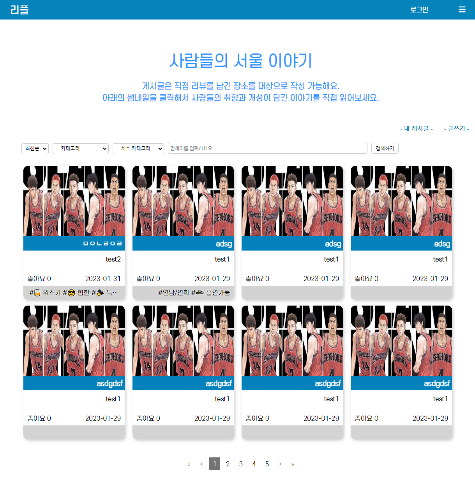
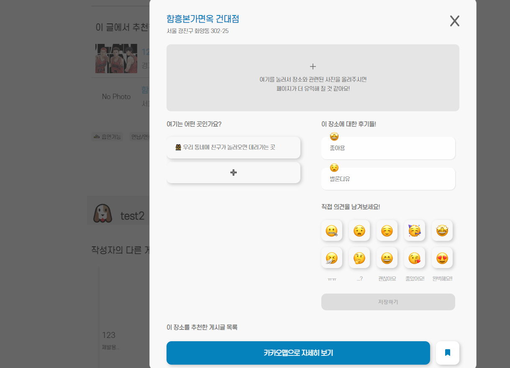

# 🗺️ 리플 (Real Place)

> 이젠아카데미 프로젝트 - 4조 ( 2022.10.31 ~ 2023.01.30 )
  
## 본 프로젝트는
진짜서울(https://jinjja-seoul.com) 클론코딩   
유저들이 장소에 대한 후기를 남기고 이를 테마별로 지정하여 검색할 수 있는 사이트
 
## 팀원
[서보선](https://github.com/sqhtjs0104), [권채림](https://github.com/zzemoo), [유지인](https://github.com/xoxoinny0) , [장윤신](https://github.com/yun-sin)

## 문서
- [최종 보고서](./re_pl보고서.pptx)
- [화면설계서](./화면설계서.pptx)
- [목업 마인드맵](./마인드맵+목업.png)

## 사용 스킬

|Front-End|Back-End|Communication|
|:---|:---|:---|
|     |  | |

 
## 사용 API, 라이브러리
> 
> 
> 
> 
> 
>   
> 
> 
> 
>   
> 
> 
> 
>   
> 
> 
> 
> 
> 
> 
> 
> 
> 
> 
> 
>   
> 

## 문제와 개선방안
- 컴포넌트 내 슬라이드 중첩 사용으로 서버 통신 횟수 증가, 사이트 속도 저하 문제   
-> 리덕스 state 자료 재편성 및 동일 기능/데이터 함수 병합

- SQL 처리 미흡   
-> SQL 반복문, 조건문 연구 및 적용, mybatis 내 구문 수정 + 테이블 구조 수정

- SEO 처리 미흡   
-> React Helmet 이용 meta 추가

- 마이페이지, 신고페이지, 데이터삭제 미구현

- 서버의 로컬 환경에서만 실행 가능(MySQL 처리 관련)   
-> Linux 서버 내 SQL 이식, SSH 키를 이용해 동작 중인 Linux 서버의 DB에 접속하도록 수정, 또한 build를 통해 생성된 리액트 배포파일 호스팅(gh-page 등)
 
## 결과 예시 화면

